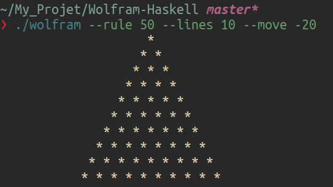
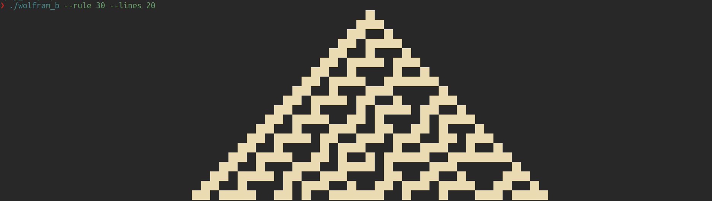

## 🔥 Wolfram Automaton in Haskell 🚀

A Haskell implementation of Wolfram's **1D Cellular Automaton**, capable of generating different rules and patterns. 🎨

## 📜 Features  

✅ Generates Wolfram automaton based on custom rules  
✅ Supports shifting (`--move`) and line customization (`--lines`)  
✅ Visual outputs for different rule sets  
✅ Efficient and functional Haskell implementation  

## 🛠️ Installation & Usage  

### 📦 Compilation  

```bash
make
```

### 🚀 Run the Automaton  

```bash
./wolfram --rule 50 --lines 10 --move -20
```

or another rule:  

```bash
make wolfram_bonus
```

```bash
./wolfram_b --rule 30 --lines 20
```

## 📸 Example Outputs  

Rule 50:



Bonus Pattern:

 Wolfram-Haskell
